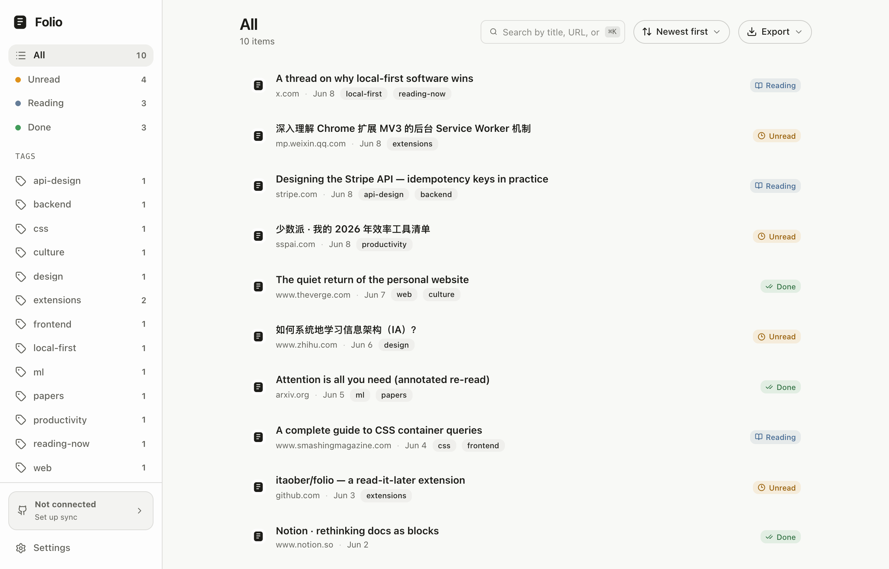
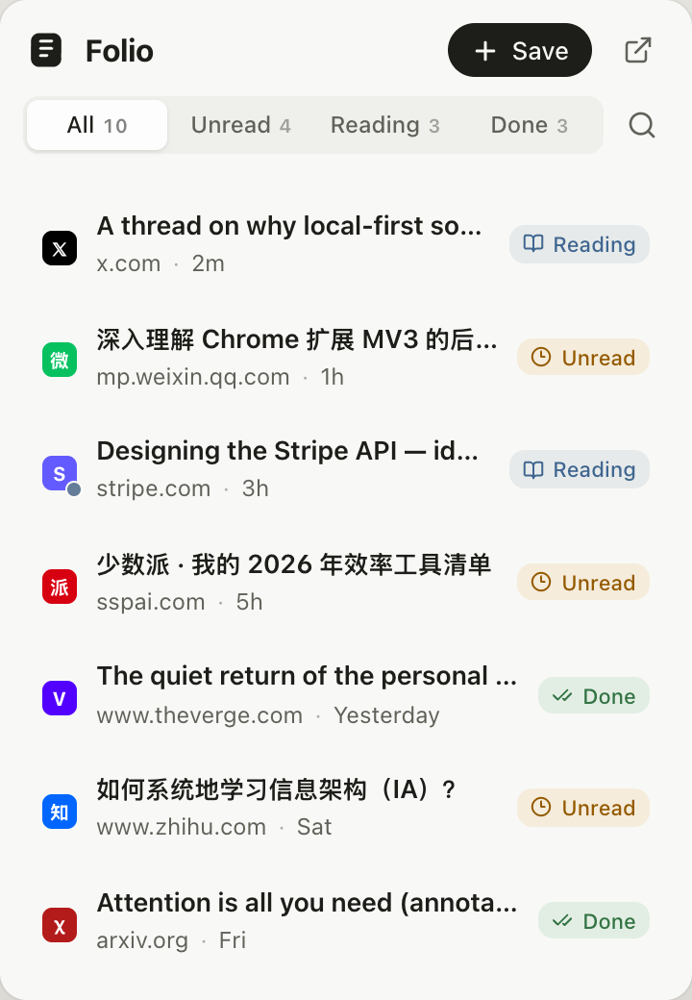
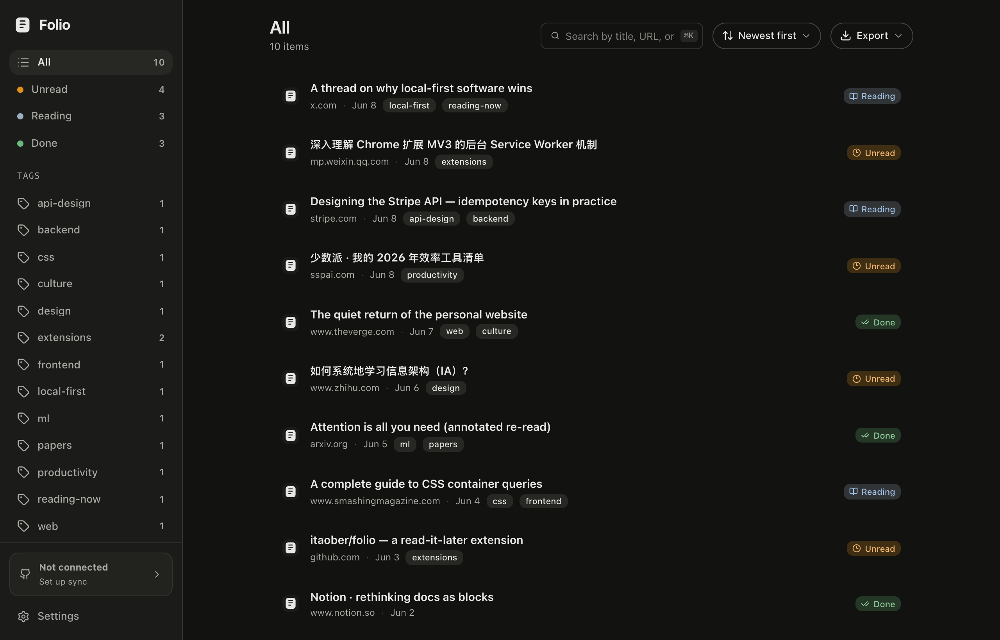
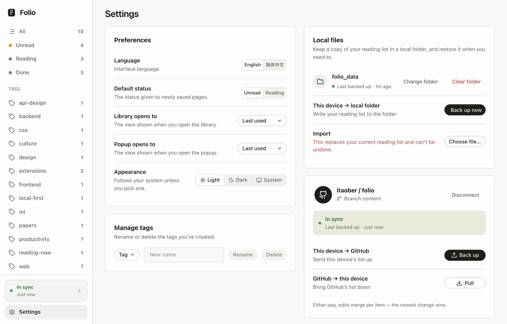

<div align="center">


# Folio

**A calm, local-first read-it-later for Chrome.**

Save a page, move it through `Unread → Reading → Done`, pick up where you left off — all on your own machine, with optional sync to your own GitHub repo.

[](https://github.com/itaober/folio/releases/latest)


[English](./README.md) · [简体中文](./README.zh-CN.md)

</div>

## ✨ Highlights

- ⚡ **One-gesture capture** — save the current tab from the popup, or right-click any page → **Save to Folio**.
- 🔖 **Status flow** — move items through `Unread → Reading → Done` with one click on the status pill.
- 📖 **Resume reading** — save your spot on a page and reopen it with the scroll position restored.
- 🔍 **Organize & find** — tags, notes, full-text search, sorting, and a `⌘K` / `Ctrl-K` command palette.
- 🔄 **GitHub sync** *(optional)* — mirror your library to a branch in your own repo; multi-device, per-item newest-wins merge.
- 💾 **Backup & export** — mirror to a local folder; export JSON / CSV / Markdown.
- 🌗 **Themes** — Light / Dark / System, applied across popup and dashboard.
- 🌐 **Bilingual** — English and 简体中文.
- 🔒 **Local-first & private** — no backend, no telemetry; the only network egress is your own GitHub.

> The toolbar icon shows the current tab's saved status as a small corner dot — amber (unread), blue (reading), green (done).

## Screenshots

<details open>
<summary><b>Dashboard · Popup · Dark mode · GitHub sync</b></summary>

<br/>

**Dashboard** — your full library, with search, tags, sorting, and the status flow.



<table>
  <tr>
    <td width="34%" valign="top"><b>Popup</b><br/>One-gesture capture &amp; triage.<br/><br/></td>
    <td valign="top"><b>Dark mode</b><br/>Light / Dark / System, applied everywhere.<br/><br/></td>
  </tr>
</table>

**Settings — GitHub sync** — connect a fine-grained token and sync to a `content` branch.



</details>

## Install

### From a release (recommended)

1. Download the latest `folio-extension-vX.Y.Z.zip` from [Releases](https://github.com/itaober/folio/releases/latest) and unzip it.
2. Open `chrome://extensions` and enable **Developer mode**.
3. Click **Load unpacked** and select the unzipped folder (the one containing `manifest.json`).

### Build from source

```bash
pnpm install
pnpm build
```

Then **Load unpacked** the `dist/` folder.

> Folio uses a fixed manifest `key`, so the extension ID stays stable across updates — use **Reload** on the extension card to keep your saved data.

## GitHub sync

Off by default and fully optional — Folio works offline with no account, and your local store is always the source of truth. Sync keeps a copy in a branch of **your own** repo.

1. Open **Settings → GitHub** in the dashboard.
2. Create a **fine-grained personal access token** scoped to a single repository with **Contents: Read and write** (Metadata read is included automatically), then paste it and connect — the branch defaults to `content`.

On first connect Folio creates an **orphan branch** (no source history) and writes just two files:

```
content
└─ folio/
   ├─ data.json       # items + tags (+ delete tombstones)
   └─ settings.json   # synced preferences
```

The token is stored only in this browser (`chrome.storage`), never in the synced files. Devices reconcile per item by newest change; Settings also exposes **Use this device → GitHub**, **Use GitHub → this device**, and a **Review & resolve** diff for the rare case where the two sides genuinely diverge.

## Privacy

- No backend, no telemetry, no analytics.
- Your reading list lives on your devices and — only if you opt in — in your own GitHub repository.
- The only network request is to `api.github.com`, with the token you provide.

## Development

Requires **Node 20+** and **pnpm 10+**.

```bash
pnpm install     # install deps
pnpm dev         # dev build with HMR (load from dist/)
pnpm typecheck   # tsc --noEmit
pnpm lint        # eslint
pnpm build       # production build → dist/
```

**Stack:** React 19 · TypeScript · Vite 7 + `@crxjs/vite-plugin` (MV3) · Tailwind CSS v4 · i18next · lucide-react.

<details>
<summary>Project structure</summary>

<br/>

```
src/
  popup/         # capture & triage panel
  options/       # dashboard: library, settings, sync
  background/    # MV3 service worker: save, context menu, toolbar dot, resume, sync
  core/          # data model, repository, selectors, exporters; sync/ (local + github)
  shared/        # faiz UI primitives, oklch tokens, i18n, theme
```

</details>
