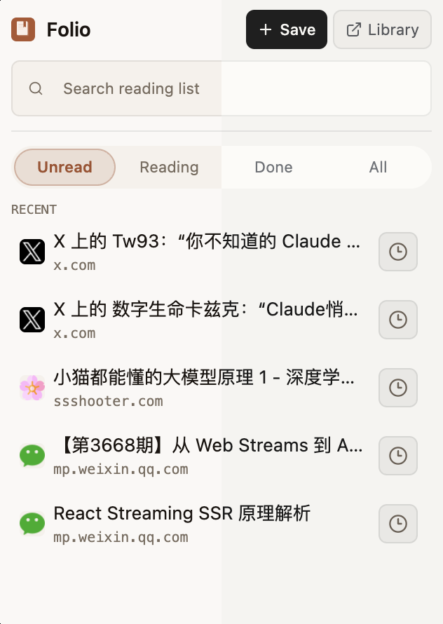
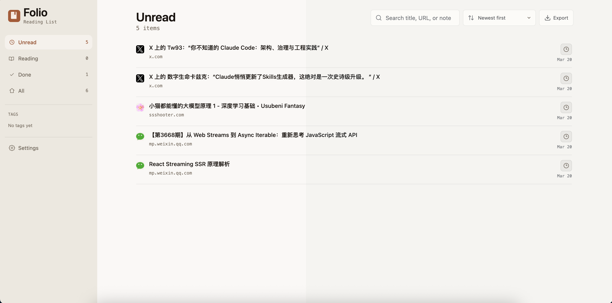
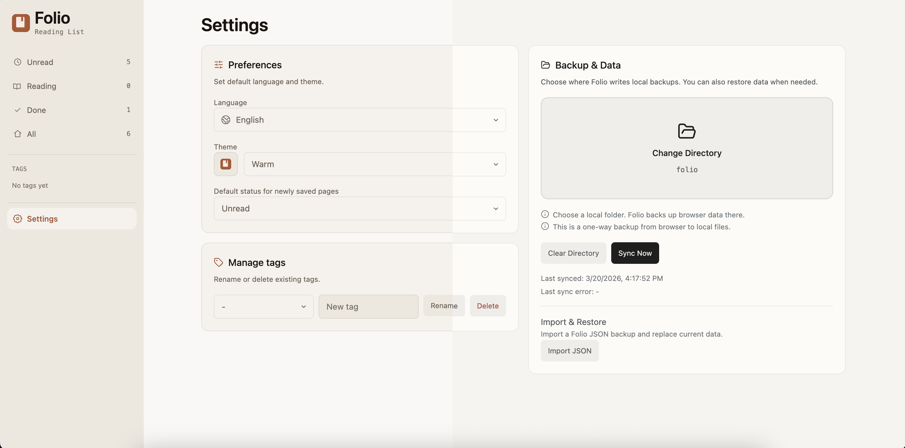

# Folio

[English](./README.md) | [简体中文](./README.zh-CN.md)

一个 Read-it-later（稍后阅读）Chrome 扩展，用于收藏网页并管理阅读状态。

## 相关链接

- 仓库地址：https://github.com/itaober/folio
- Release 列表：https://github.com/itaober/folio/releases
- 最新 Release：https://github.com/itaober/folio/releases/latest

## 截图

> 中线分割对比：左侧为暖色主题，右侧为黑白灰主题。

<details open>
  <summary><strong>Popup</strong></summary>
  <p align="center">
    
  </p>
</details>

<table>
  <tr>
    <td width="50%" valign="top">
      <details open>
        <summary><strong>Options · 列表页</strong></summary>
        <p align="center">
          
        </p>
      </details>
    </td>
    <td width="50%" valign="top">
      <details open>
        <summary><strong>Options · 设置页</strong></summary>
        <p align="center">
          
        </p>
      </details>
    </td>
  </tr>
</table>

## 主要功能

- 待读优先工作流
- 从弹窗或右键菜单快速收藏页面
- 阅读状态流转：`待读` -> `在读` -> `已读`
- 标签筛选与管理
- 行内编辑（`标题`、`备注`、`标签`）
- 后台页面搜索与排序
- 本地目录备份同步（浏览器 -> 本地）
- 中英文界面

## 安装

### 方式 A：从 GitHub Release 安装（推荐）

1. 在 [Releases](https://github.com/itaober/folio/releases) 下载最新 `folio-extension-vX.Y.Z.zip`。
2. 解压文件。
3. 打开 `chrome://extensions`。
4. 开启 **开发者模式**。
5. 点击 **加载已解压的扩展程序**，选择包含 `manifest.json` 的目录。

### 方式 B：本地构建

```bash
pnpm install
pnpm build
```

然后在扩展管理页通过“加载已解压的扩展程序”选择 `dist`。

## 开发

- Node.js 20+
- pnpm 10+

```bash
pnpm install
pnpm dev
pnpm typecheck
pnpm build
```

## 手动发布（GitHub Actions）

流程文件：`.github/workflows/manual-release.yml`

在 GitHub Actions 页面点击 **Run workflow** 触发。流程会校验版本号、更新版本、构建并打包扩展、生成校验文件、推送 tag，并创建 GitHub Release。

输入参数：

- `version`（必填）：数字版本号，例如 `0.2.0`
- `draft`：是否创建草稿发布
- `prerelease`：是否标记为预发布
- `release_notes`：可选；留空时自动生成发布说明

## 项目结构

```text
src/
  background/     # service worker 逻辑
  popup/          # popup 界面
  options/        # 后台/选项页界面
  core/           # store、selectors、repository、sync 逻辑
  shared/         # 共享样式、i18n、ui 组件
public/
  icons/          # 扩展图标资源（png + svg）
```

## 技术栈

- React + TypeScript
- Vite + CRXJS plugin
- Tailwind CSS v4
- i18next

## 说明

- 通过 GitHub Release + “加载已解压的扩展程序”安装时，需要开启 Chrome 开发者模式。
- 项目使用固定 manifest key，保证版本升级后扩展 ID 稳定。
- 升级时保留同一个扩展条目并点击“重新加载”，可保留 `chrome.storage.local` 数据。
